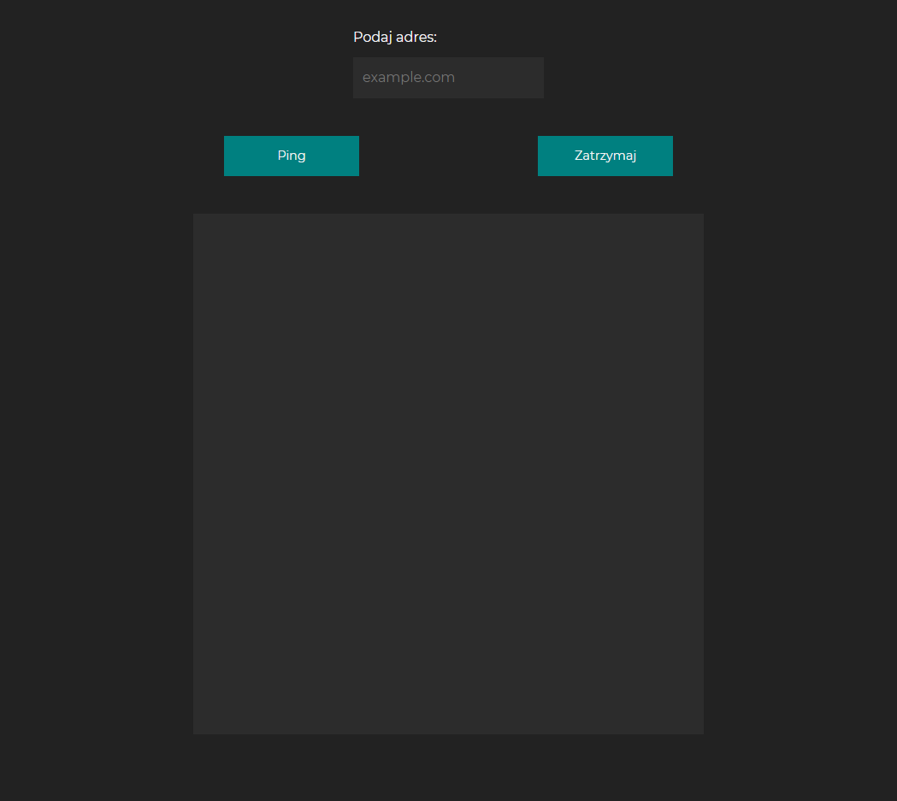

> Early-stage project created before my commercial experience.
# PingFromServer
Upload the PHP file to your server and run the app on your PC or smartphone to ping addresses from it.
 
Used technology: HTML5, CSS3, JavaScript, PHP.
 
 
 
Home screen.
 
 

 
 
 
Pinging domain.
 
 

 
 
 
Pinging Ip address (Google DNS).
 
 

