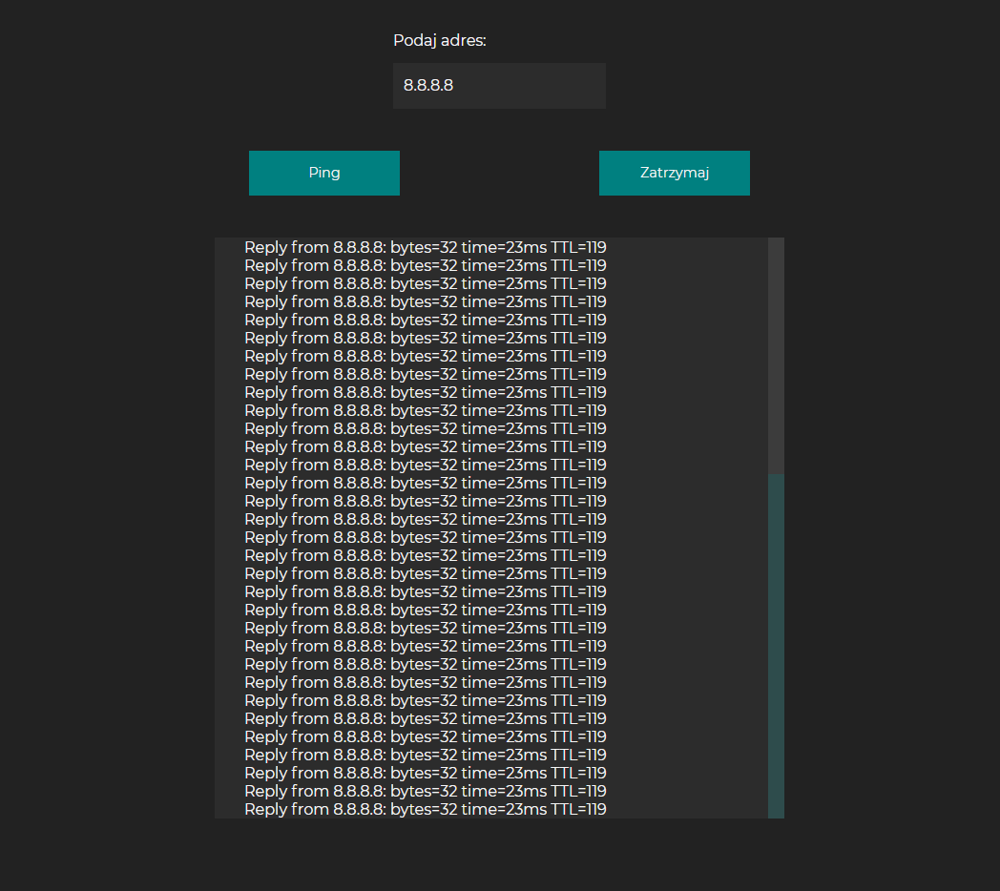

# PingFromServer
You could add php file on your server machine and run this app on your pc or smartphone then you can ping some addresses from your server.
 
Created using HTML, CSS , JavaScript, PHP.
 
 
 
Home screen.
 
 

 
 
 
Pinging domain.
 
 

 
 
 
Pinging Ip address (Google DNS).
 
 

